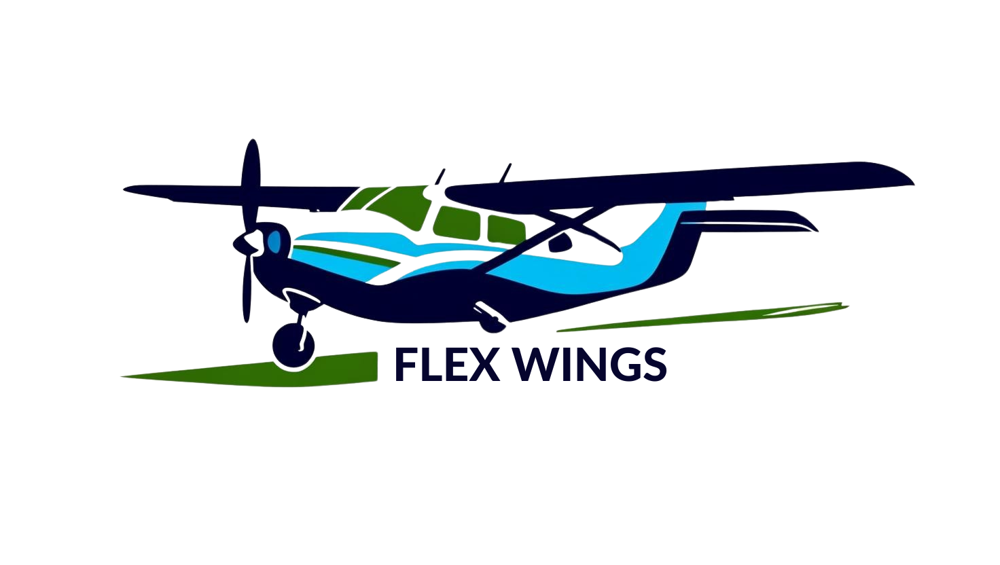
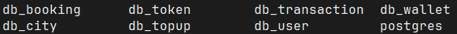
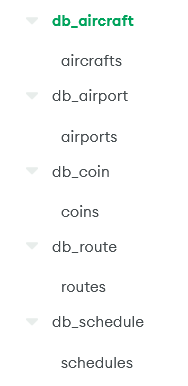
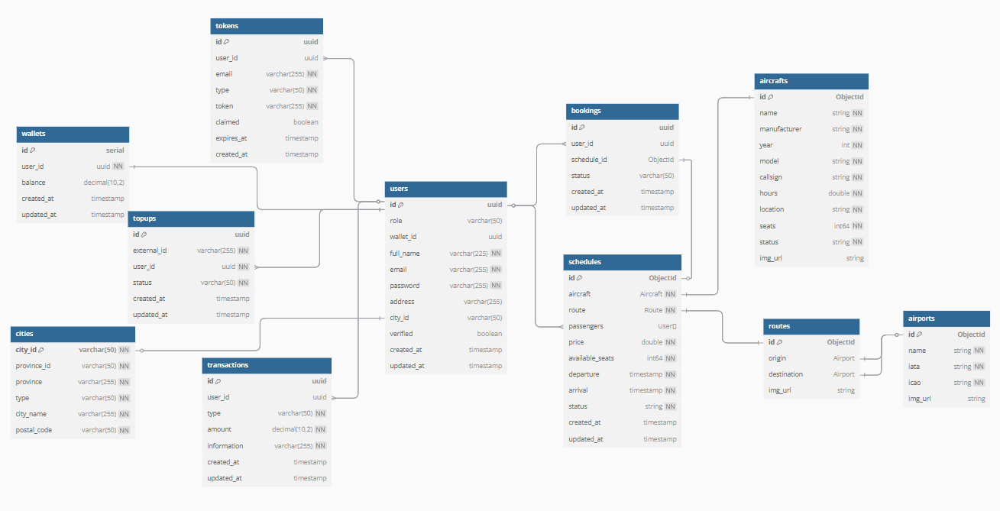
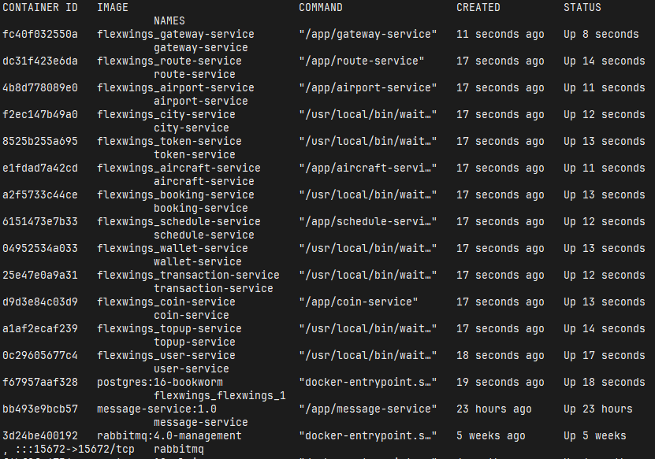
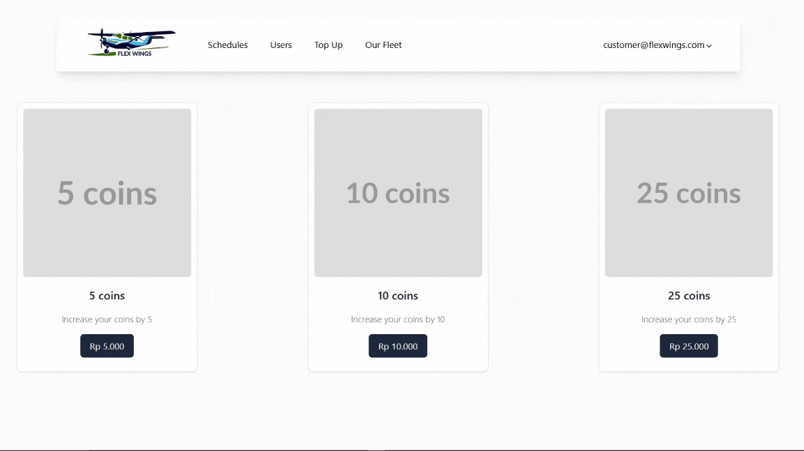

# [Flex Wings](https://api.flexwings.web.id)

> A reliable, maintainable, and highly scalable app for a small airline business. Designed with microservices architecture, where each core functionality is encapsulated in separate, self-contained services, and communication between these services is managed using gRPC for low-latency, high-performance interactions. The system is containerized using Docker, ensuring consistent deployment across environments. RabbitMQ is utilized as the message broker to facilitate the asynchronous processing of tasks, such as email notifications.

# Databases
## PostgreSQL

## MongoDB

# ERD

# Services

# Simulate payment

---
# [https://api.flexwings.web.id](https://api.flexwings.web.id)
